# CleverHand
Module        |  Bracelet factor
:-------------------------:|:-------------------------:
 |  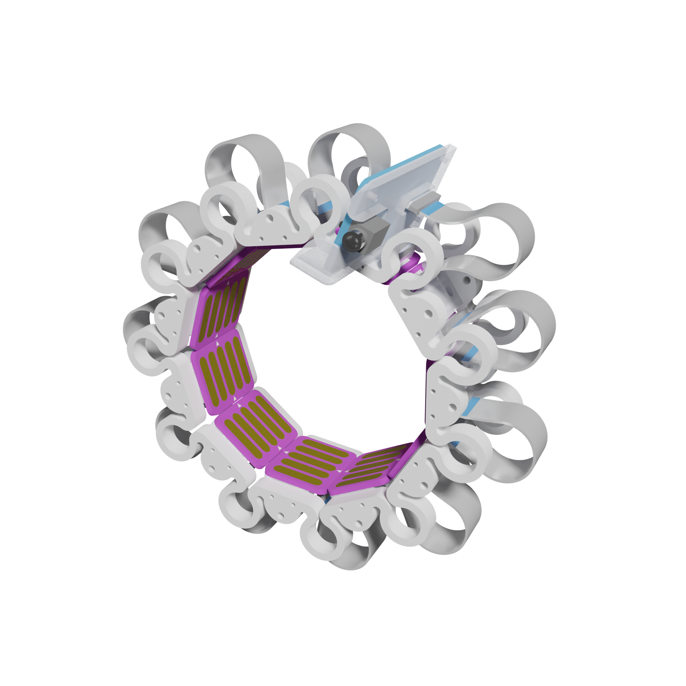

## Description

CleverHand is a low-cost, highly modular, and open-source Human-Machine Interface (HMI). This system offer the possibility to record and process bio-signals (EMG, ECG, EEG, etc.), kinematics data (accelerometer, gyroscope, magnetometer, etc.), and simultaneously provide a real-time feedback to the user (vibration, LED, Electro-stimulation, etc.). The system is based on a modular architecture, which allows the user to easily add or remove modules to adapt the system to his needs.

Cleverhand is deigned primarily for research and educational purposes. It allows the user to easily set up a wide range of experiments, from simple EMG recordings to complex Human-Machine Interaction (HMI) experiments. 

## Requirememts
| **Constraint** |Status|Comment|
:---:|:---:|:---:|
|Wearable | :hammer:| Wifi feature in progress|
|>16 channels | :heavy_check_mark:| Up to 256 channels (32x8) |
|>2kHz bandwidth|:heavy_check_mark:| Up to 2.5kHz|
|>=16 bits resolution|:heavy_check_mark:| Up to 24bits|
|Bipolar/Monopolar |:heavy_check_mark:||
|Modular | :heavy_check_mark:| 1 to 32 modules by bus|
|Affordable | :heavy_check_mark:| £10-£30 per modules|
|Opensource |:heavy_check_mark:||

## Features
The system is composed of a controller module and a set of HMI modules. 

### Controller module
The controller module is the core of the system. It is responsible for the communication between the HMI modules and the computer. It is based on a microcontroller (Teensy 4.1) and a communication module (ESP32). The controller module is equipped with a USB, ethernet and WiFi interface, which allows the user to easily connect the system to a computer. The controller module is also equipped with a microSD card, which allows the user to store the data locally.

### HMI modules
The HMI modules are responsible for the bio-signal acquisition and the real-time feedback. The HMI modules are themeseleves composed of several sub-modules, which can be easily connected to each other:

- **Communication module**: This sub-module is responsible for handling the communication between the different modules of the controller.
- **Sensor module**: This sub-module is responsible for acquiring the signals (EMG, ECG, EEG, IMU, etc.).
- **Feedback module**: This sub-module is responsible for providing a real-time feedback to the user (vibration, LED, Electro-stimulation, etc.).
- **Electrode module**: This sub-module is responsible for providing the interface between the sensor module and the user (electrodes, accelerometers, etc.).
- **Interface module**: This sub-module is responsible for extending the electrode module with additional features (Jack connector, flexible PCB, etc.).

#### List of modules

| Module | Description | Front | Back | Link |
|--------|-------------|-------|------|--|
| Communication | Handles the communication between the modules of the controller. |  |  | [Link](KiCad/modules/COM_MOD/README.md) |
| EMG ADS1293  | Acquires 5 channels of EMG signals. | 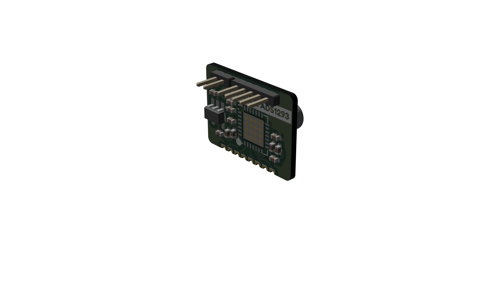 | 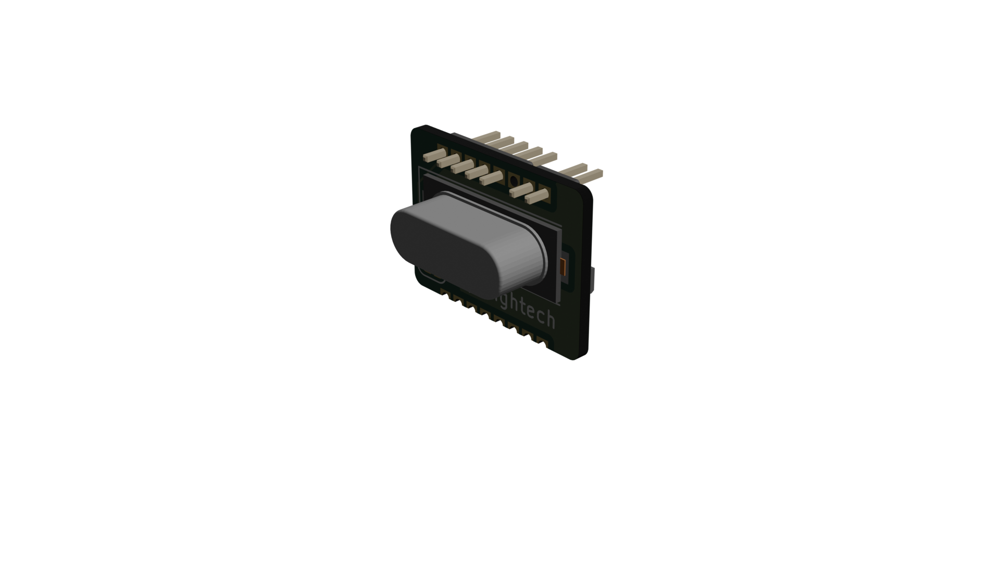 | [Link](KiCad/modules/EMG_DAQ_ADS1293/README.md) |
| EMG ADS1298  | Acquires 8 channels of EMG signals. | 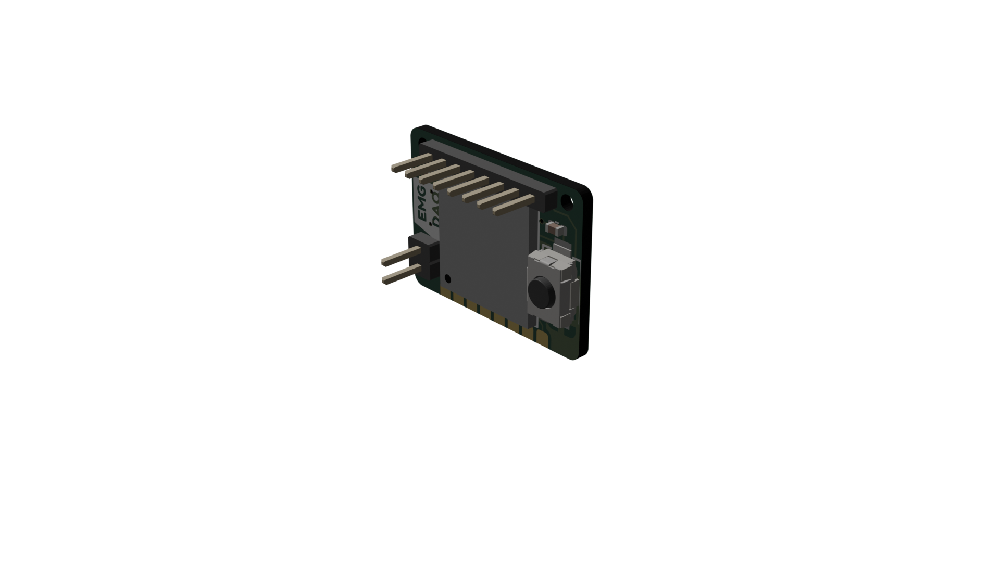 | 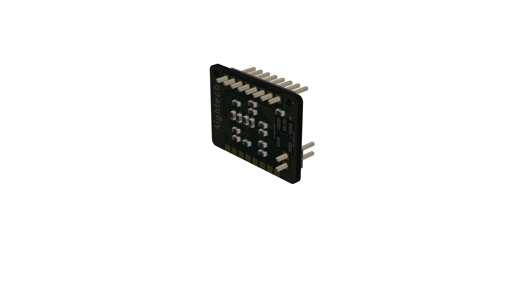 | [Link](KiCad/modules/EMG_DAQ_ADS1298/README.md) |
| EMG INA331   | Acquires 1 channel of EMG signals + 3-axis accelerometer. |  |  | [Link](KiCad/modules/EMG_INA331/README.md) |
| FES AO4882   | Provides 4 channels of electro-stimulation. |  | 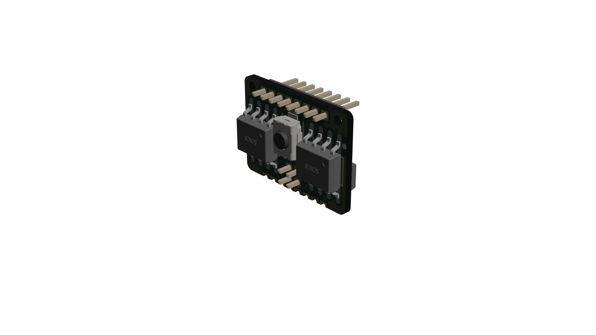 | [Link](KiCad/modules/FES_AO4882/README.md) |
| IMU ICM2094  | Acquires 3-axis accelerometer, 3-axis gyroscope, 3-axis magnetometer. |  |  | [Link](KiCad/modules/IMU_ICM2094/README.md) |
| DRY Electrodes | Provides 16 channels of dry electrodes. | 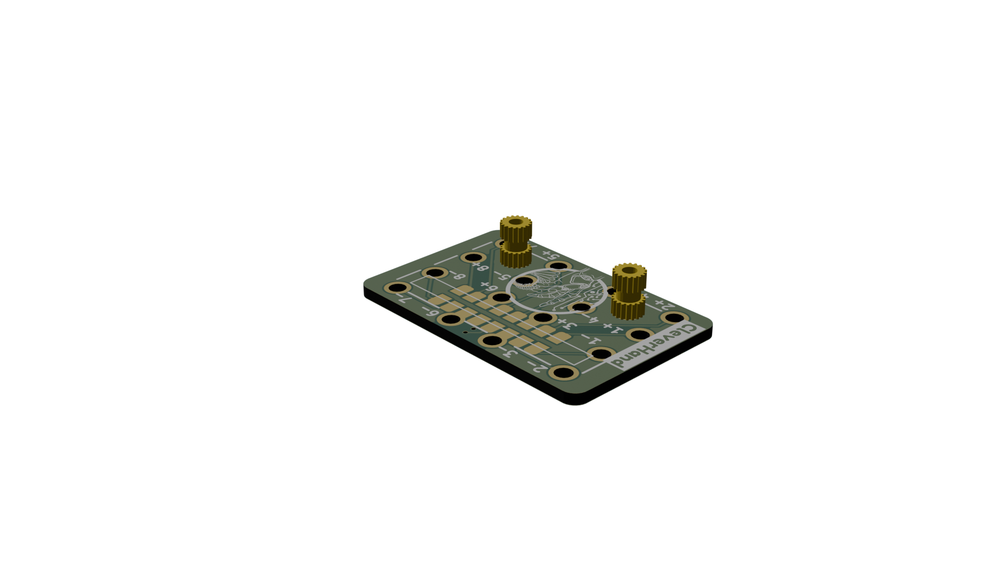 | 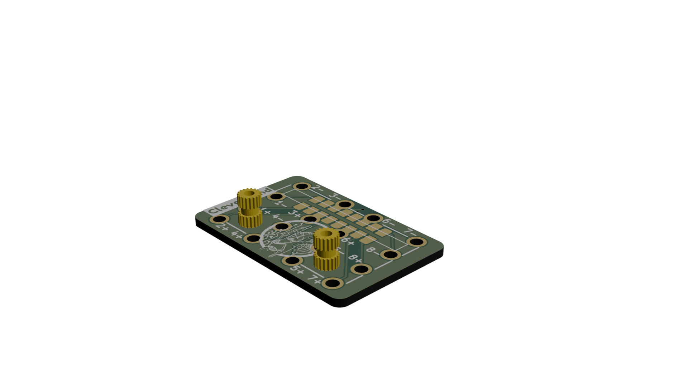 | [Link](KiCad/modules/DRY_ELECTRODES/README.md) |
| DRY Flex | Provides 8 bipolar channels on a flexible PCB. | 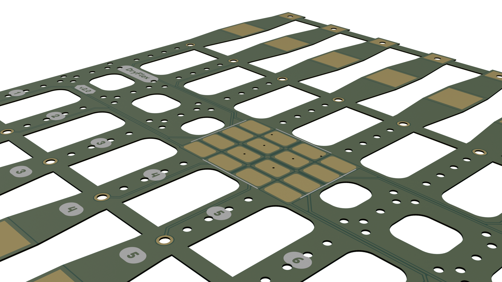 |  | [Link](KiCad/modules/DRY_FLEX/README.md) |
| Jack Connector | Provides a jack connector for the electrode module. | 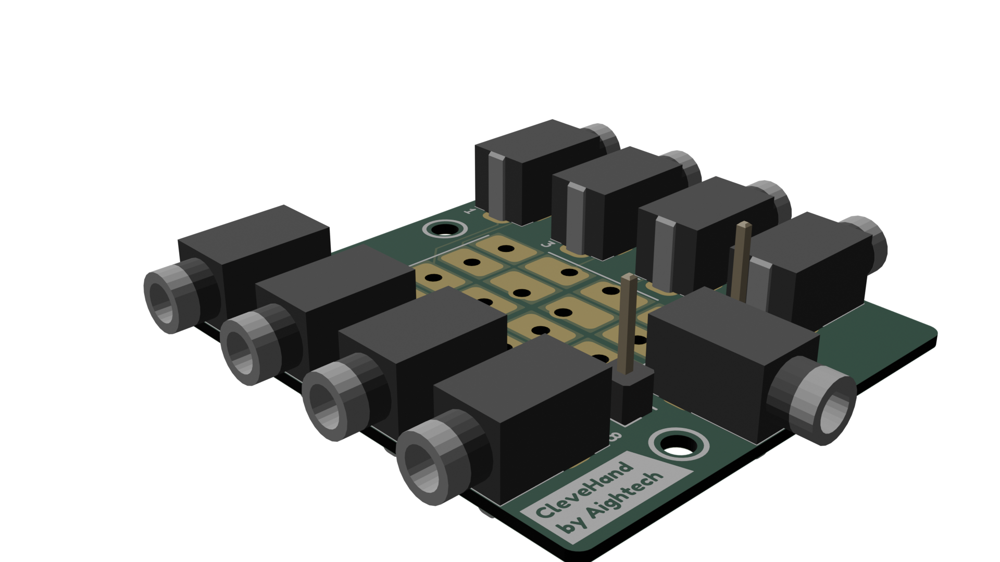 |  | [Link](KiCad/modules/JACK_CONN/README.md) |

#### Combinaisons of sub-modules
The HMI modules can be easily combined to create a wide range of experiments. Here are some examples of combinaisons:
| Combination | Front | Back |
|-------------|-------|------|
| Communication + EMG ADS1293 + DRY Electrodes | 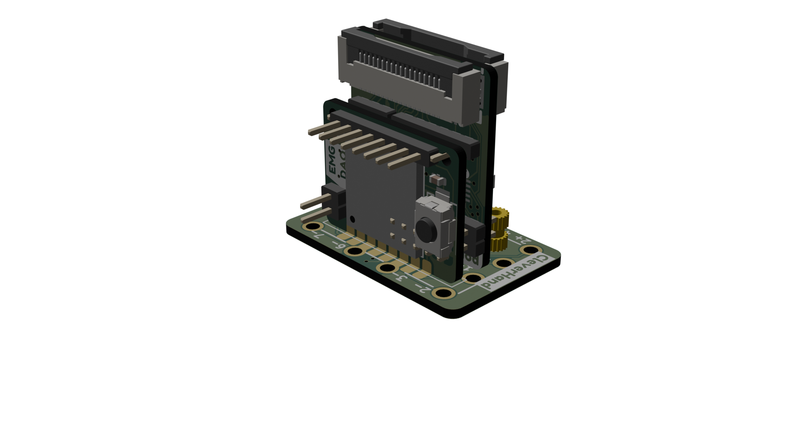 |  |
| Communication + EMG ADS1298 + DRY Electrodes |  | 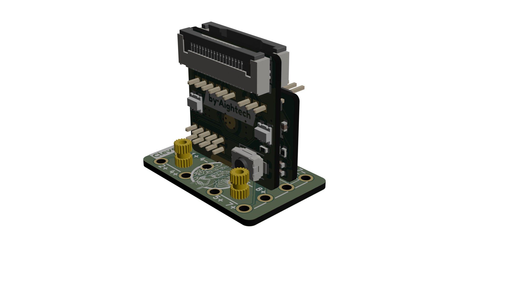 |
| Communication + EMG INA331 + DRY Electrodes | 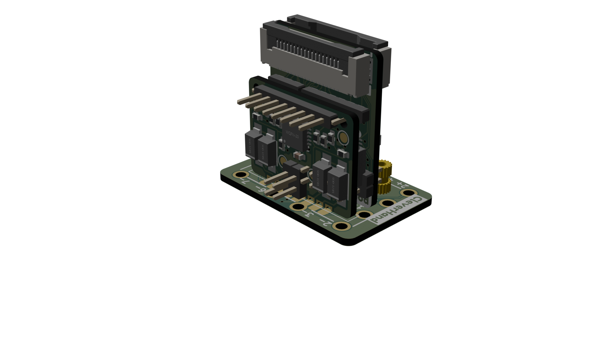 |  |
| Communication + FES AO4882 + DRY Electrodes | 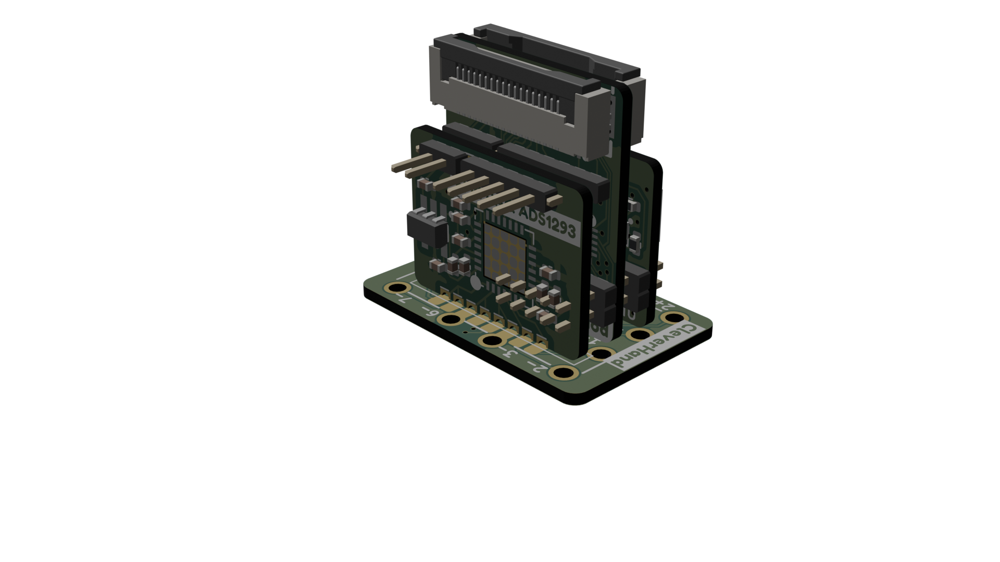 | 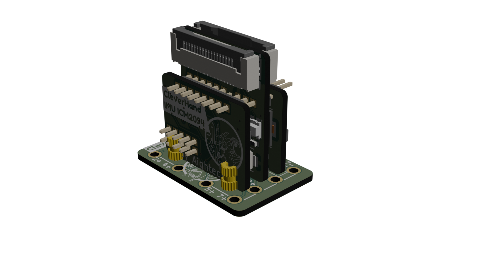 |
| Communication + IMU ICM2094 + EMG ADS1293 + DRY Electrodes | 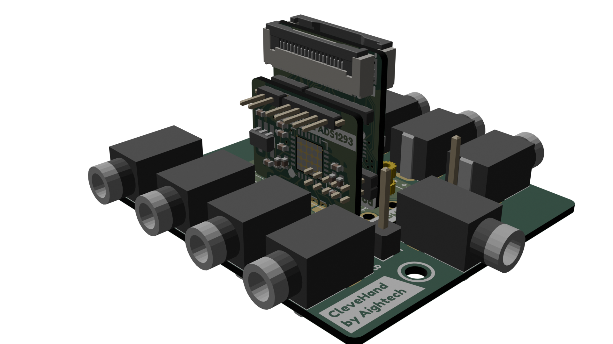 | 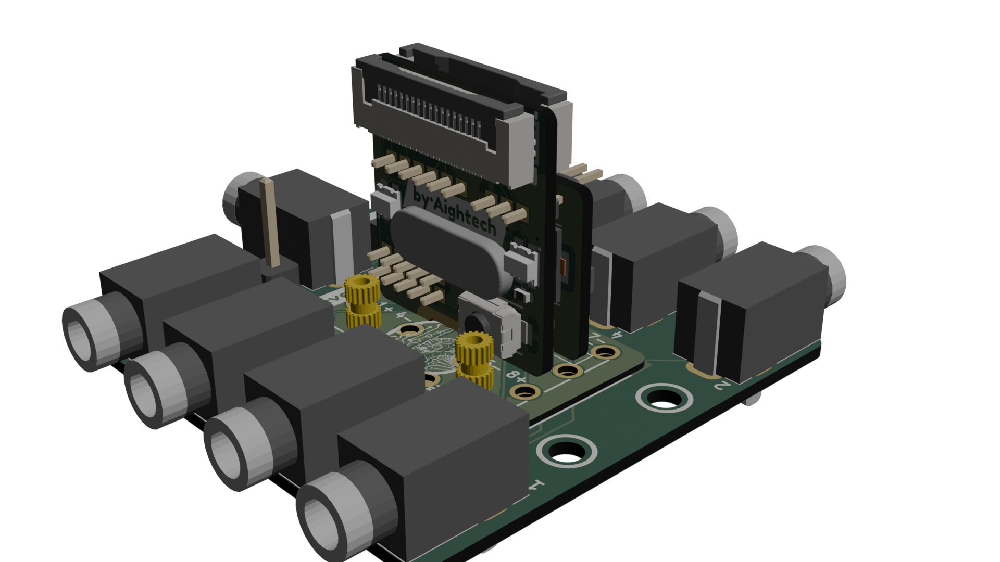 |

## Modular architecture

The system uses a shared bus architecture, which allows the user to easily add or remove modules to adapt the system to his needs. The controller module communicates with the HMI modules 5bits address, a SPI bus, an I2C bus. The communication between the modules is handled by the communication module, which activates the chip select line of the associated sensor module when the address bus matches its address. Additionally, each module has a unique identifier that is used to identify the module on the I2C bus.

This module is responsible for handling the communication between the different modules of the controller node.

## Communication Bus

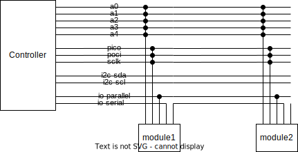

### Addressing system
Each module is associated with a unique address 5bits address set during the initialization protocol. Each module constantly compares the address bus with its address and activates the chip select line when the address bus matches its address. The address bus is set by the controller depending on the module to communicate with.

#### Initialization protocol
Description of the initialization protocol: TODO
1) How to set the address of each module depending of their position in the bus at the initialization of the system.
2) Is there a way to dynamically add or remove modules from the bus without reinitializing the system?

# Evaluation plan
- Communication System
    - Addressing
        - **TODO** initialisation protocol
        - selection speed (evaluate the time from the setting of the address bus to the activation of the chip select line)
 - SPI
    - speed/nb of modules (evaluate the maximum speed of the SPI bus before the signal becomes distorted, evaluate this speed for different number of modules)
    - reliability (evaluate the number of corrupted bits for different number of modules and speed)
- Sensor Modules
    - precision (evaluate the precision of the EMG/IMU modules in laboratory conditions=> electrodes connected to a signal generator)
    - noise 
- Electrode Modules
    - impedance (evaluate the impedance of the electrodes) 
    - comfort (run a user study to evaluate the comfort of the electrodes)
- Feedback Modules
    - precision ( run a user study to evaluate the precision of the feedback modules)
    - latency
- Portability/Wearable
    - weight
    - autonomy